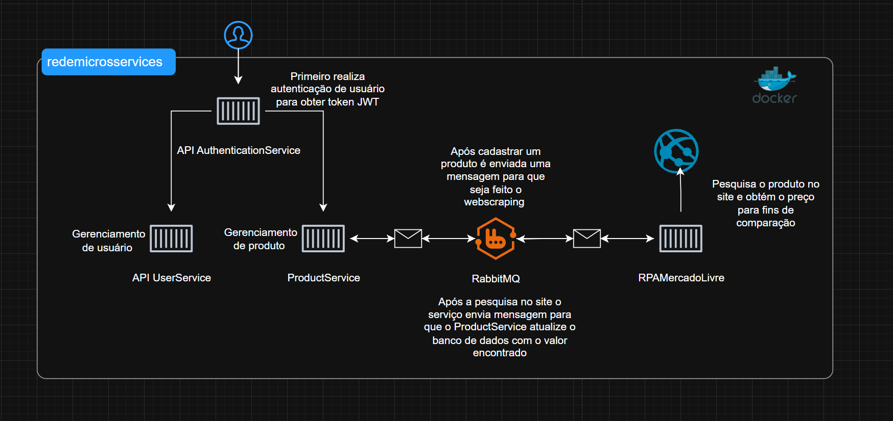
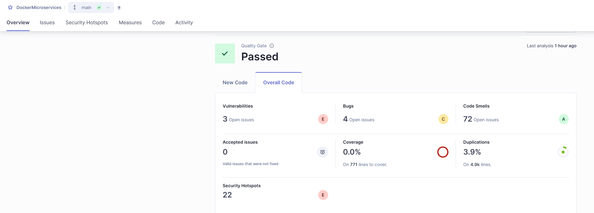

<h1 align="center">🚧 Projeto em Construção... 🚧</h1>

<h1 align="center">DockerMicroservices</h1>

## 🛠 Tecnologias Utilizadas
<p align="left">         

</p>

<br><br>

## 📚 Sobre o Projeto
<p>Este projeto foi desenvolvido com o objetivo de aprender e aperfeiçoar meus conhecimentos na implementação de microsserviços utilizando Docker e Docker Compose, com a tecnologia .NET 8. Integra diversas bibliotecas como Entity Framework (ORM), AutoMapper, RabbitMQ para mensageria e MediatR para implementação do padrão CQRS.

Além disso, o projeto tem como propósito aplicar e demonstrar conceitos sólidos de arquitetura de software como CQRS, Clean Architecture e Domain-Driven Design (DDD).

Para garantir a qualidade e confiabilidade do código, utilizei SonarQube como ferramenta de análise estática para identificar bugs, code smells, vulnerabilidades e pontos de melhoria no projeto. A análise contínua com SonarQube contribui diretamente para a manutenção de um código limpo e sustentável.

Nos testes unitários, empreguei as bibliotecas Bogus e FluentAssertions, facilitando a criação de dados realistas e a escrita de asserções claras e concisas. Para a criação de mocks e simulações de dependências, utilizei a biblioteca NSubstitute.</p>

<ul>
  <li><strong>CQRS (Command Query Responsibility Segregation)</strong>: Esta é uma abordagem de design de software que separa a lógica de leitura da lógica de escrita, permitindo que as consultas sejam otimizadas para leitura e os comandos para escrita. Isso pode melhorar a escalabilidade e a performance do sistema.</li>
  <li><strong>Clean Architecture</strong>: Este é um modelo arquitetural que promove a separação de preocupações e a organização do código em camadas, garantindo que a lógica de negócio fique independente de detalhes de implementação, como frameworks e interfaces de usuário. Isso facilita a manutenção e a escalabilidade do projeto.</li>
  <li><strong>Domain-Driven Design (DDD)</strong>: Este é um conjunto de princípios e padrões que ajudam a criar sistemas de software que refletem com precisão as regras e processos do domínio de negócios. Utiliza conceitos como Entidades, Agregados e Repositórios para modelar a lógica de negócio de forma coesa e compreensível.</li>
</ul>


<br><br>

## ⚙️ O que o Projeto Faz

Este projeto é composto por microsserviços que se comunicam entre si por meio de mensagens assíncronas (RabbitMQ) e seguem princípios de arquitetura limpa (Clean Architecture), DDD e CQRS.

- **AuthenticationService** (`172.18.0.8`): realiza login de usuários e gera tokens JWT.
- **UserService** (`172.18.0.7`): gerenciamento de usuários (CRUD).
- **ProductService** (`172.18.0.5`): cadastro e consulta de produtos; publica e consome mensagens do RabbitMQ.
- **RabbitMQ** (`172.18.0.9`): orquestra as mensagens entre os microsserviços.
- **RPAMercadoLivreService** (`172.18.0.10`): realiza scraping no site do Mercado Livre e envia o preço encontrado de volta via RabbitMQ.

📌 Todos os serviços estão configurados no Docker Compose com IPs fixos na rede `redemicrosservices`.


<br><br>


## 🔁 Fluxo de Interação entre os Microsserviços

O diagrama abaixo representa o fluxo de comunicação entre os microsserviços da aplicação, utilizando autenticação, orquestração via RabbitMQ e scraping externo:

- O usuário inicia o processo autenticando-se via **AuthenticationService** para obter o token JWT.
- Após autenticado, é possível acessar os endpoints de **UserService** (gerenciamento de usuários) e **ProductService** (cadastro e consulta de produtos).
- Ao cadastrar um produto, o **ProductService** envia uma mensagem para o **RabbitMQ**, solicitando que o **RPAMercadoLivre** faça o scraping no site do Mercado Livre.
- O **RPAMercadoLivre**, ao obter o valor do produto no site, envia uma nova mensagem para o **RabbitMQ**, que é consumida pelo **ProductService** para atualizar a base de dados.

📌 Essa abordagem assíncrona garante desacoplamento entre os serviços e melhora a escalabilidade.



<br><br>


## 📊 Análise de Qualidade com SonarQube

Este projeto foi analisado com a ferramenta **SonarQube**, que ajudou na identificação de bugs, code smells, vulnerabilidades e pontos de melhoria no código.

✔️ **Status:** Aprovado no Quality Gate

📊 **Métricas de exemplo:**
- Cobertura de testes: `0.0%` (em evolução)
- Duplicações: `3.9%`
- Bugs: `4`
- Vulnerabilidades: `3`
- Code Smells: `72`

📷 *Exemplo do resultado da análise visual:*




<br><br>

<br>
<br>

## 📈 Status do Projeto
<p>

[x] Organizar solução separando projetos e itens por pastas<br>

[x] Adicionar .gitignore para C#<br>

[x] Trocar Dapper por Entity Framework<br>

[x] Criar API para gerar e validar tokens JWT<br>

[x] Remover serviço mssqltools e criar banco por migrations<br>

[x] Implementar RabbitMQ<br>

[x] Implementar AutoMapper<br>

[x] Padrão CQRS <br>

[x] Implementar Clean Architecture <br>

[x] Adicionar conceitos DDD (Event, ValueObject, Enum, Repository, Service e etc)<br>

[x] Criar Validações com FluentValidation

[x] Adicionar exemplos de testes unitários e de integração

[x] Adicionar SonarQube 

[x] Remover Warnings

</p>
<br>
<br>


## 📥 Clone o Repositório
```
$ git clone https://github.com/richardvepogg/DockerMicroservices.git
```
<br>
<br><br>

## 🛠 Pré-Requisitos
<p>

Instalar Docker Desktop: ao instalar marque a caixa "Install required Windows components for WSL2".<br>

Acessar a solução com Visual Studio. </p>

<br><br>

## 🛠️ Criação e Configuração do Banco de Dados
### Etapas para rodar as migrations e popular o banco:

1. **Suba o container do SQL Server**, caso ainda não esteja executando:
   ```
   docker start sqlserver
   ```

2. **Pare a execução em modo debug no Visual Studio**, se estiver ativa.

3. **Atualize temporariamente a string de conexão** no `appsettings.Development.json` para utilizar `localhost`:
   ```json
   "ConnectionStrings": {
     "Default": "Server=localhost,1433;Database=Users;User Id=sa;Password=microservicos123!;TrustServerCertificate=true"
   }
   ```

4. No **Visual Studio**:
   - Defina o projeto principal (por exemplo, `UserService.WebApi`) como *Startup Project*.
   - Abra a janela **Package Manager Console**.
   - Selecione o projeto `*.Data` como *Default Project*.

5. **Execute o comando abaixo** no Package Manager Console:
   ```
   Update-Database
   ```

6. Após aplicar a migration, **atualize novamente a string de conexão** para usar o hostname configurado no `docker-compose.yml`:
   ```json
   "ConnectionStrings": {
     "Default": "Server=hostsqlserver;Database=Users;User Id=sa;Password=microservicos123!;TrustServerCertificate=true"
   }
   ```

---
Necessário realizar os passos acima para ProductService e UserService

### 👤 Inserir um usuário administrador no banco:

Após o banco User ser criado, execute o script abaixo diretamente no seu SQL Server (via SSMS, Azure Data Studio ou DBeaver):

```sql
INSERT INTO Users (id, name, email, phone, password, role)
VALUES (
  1,
  'adm',
  'adm@vepoit@gmail.com',
  '(48) 99142-2442',
  'SenhaForte123#',
  '2' 
);
```

<br><br>


## 💻 Passos para a Criação dos Containers
<p>

Executar Docker Desktop.<br>

No Visual Studio, selecione o Docker Compose no depurador e execute.<br>

<br><br>


## 🗂️ Estrutura dos Containers
<b>Redes:<b>
<br>
<p> <b>redemicrosservices</b>: Rede bridge com a sub-rede <code>172.18.0.0/16</code>. </p>
<br>
<b><p>Containers e Endpoints:</p></b>
<p> <b>SQL Server</b><br> <b>Imagem</b>: <code>mcr.microsoft.com/mssql/server:2022-latest</code><br> <b>Container Name</b>: <code>sqlserver</code><br> <b>Hostname</b>: <code>hostsqlserver</code><br> <b>Volumes</b>: <code>./volumes:/var/opt/mssql/data</code><br> <b>Portas</b>: <code>1433:1433</code><br> <b>Endereço IP</b>: <code>172.18.0.6</code><br> <b>Ambiente</b>:<br>

<code>ACCEPT_EULA: 'Y'</code><br>

<code>MSSQL_SA_PASSWORD: 'microservicos123!'</code><br>

<code>MSSQL_PID: 'Developer'</code> </p>

<p> <b>RabbitMQ</b><br> <b>Imagem</b>: <code>rabbitmq:3-management</code><br> <b>Container Name</b>: <code>rabbitmq</code><br> <b>Portas</b>: <code>5672:5672</code>, <code>15672:15672</code><br> <b>Endereço IP</b>: <code>172.18.0.9</code><br> <b>Ambiente</b>:<br>

<code>RABBITMQ_DEFAULT_USER: 'adm'</code><br>

<code>RABBITMQ_DEFAULT_PASS: '123'</code> </p>

<p> <b>UserService</b><br> <b>Imagem</b>: <code>api-usuarios</code><br> <b>Container Name</b>: <code>apiUsuarios</code><br> <b>Dockerfile</b>: <code>ProductService\UserService.WebApi\Dockerfile</code><br> <b>Portas</b>: <code>5020:5020</code><br> <b>Endereço IP</b>: <code>172.18.0.7</code><br> <b>Depende de</b>: <code>sqlserver</code> </p>

<p> <b>AuthenticationService</b><br> <b>Imagem</b>: <code>api-autenticacao</code><br> <b>Container Name</b>: <code>apiAutenticacao</code><br> <b>Dockerfile</b>: <code>AuthenticationService\AuthenticationService.WebApi\Dockerfile</code><br> <b>Portas</b>: <code>5030:5030</code><br> <b>Endereço IP</b>: <code>172.18.0.8</code><br> <b>Depende de</b>: <code>apiusuarios</code> </p>

<p> <b>RPAMercadoLivreService</b><br> <b>Imagem</b>: <code>console-rpamercadolivre</code><br> <b>Container Name</b>: <code>rpaMercadoLivre</code><br> <b>Dockerfile</b>: <code>RPAMercadoLivreService\RPAMercadoLivre.Console\Dockerfile</code><br> <b>Endereço IP</b>: <code>172.18.0.10</code><br> <b>Depende de</b>: <code>rabbitmq</code> </p>

<p> <b>ProductService</b><br> <b>Imagem</b>: <code>api-cadastroproduto</code><br> <b>Container Name</b>: <code>cadastroProduto</code><br> <b>Dockerfile</b>: <code>ProductService\ProductService.WebApi\Dockerfile</code><br> <b>Portas</b>: <code>5010:5010</code><br> <b>Endereço IP</b>: <code>172.18.0.5</code><br> <b>Depende de</b>: <code>sqlserver</code>, <code>rabbitmq</code> </p>
<br><br>


## 🌐  Endpoints
<p><b>(SQL Server)</b> iniciará na porta: <code>1433</code><br><b>(RabbitMQ)</b> iniciará nas portas: <code>5672</code> e <code>15672</code><br><b>(UserService)</b> iniciará na porta: <code>5020</code> - <code>http://localhost:5020/swagger</code><br><b>(AuthenticationService)</b> iniciará na porta: <code>5030</code> - <code>http://localhost:5030/swagger</code> <br><b>(ProductService)</b> iniciará na porta: <code>5010</code> - <code>http://localhost:5010/swagger</code><br><b>(RPAMercadoLivreService)</b> não possui porta exposta, apenas vai receber mensagens e enviar através do rabbitmq<br></p>
